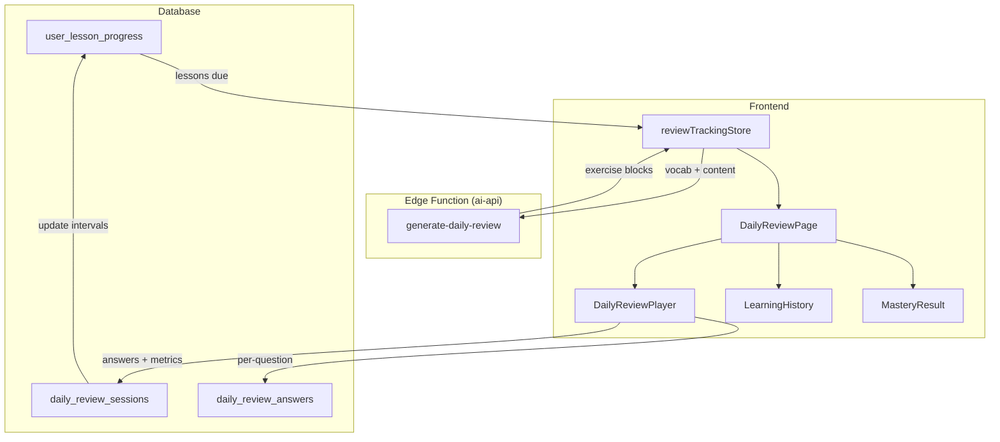

# Daily Review & Learning Tracking — Design Spec

**Date**: 2026-03-25  
**Status**: Draft — Pending Review

---

## 1. Problem Statement

Scribe hiện tại thiếu:
- **Tracking lịch sử học** — không biết user đã học gì, hoàn thành gì, mốc thời gian
- **Ôn tập có hệ thống** — không có spaced repetition ở cấp lesson (chỉ có SRS cho từ vựng)
- **Đánh giá thuần thục** — không có cách xác nhận user đã nắm vững kiến thức trước khi chuyển bài mới

## 2. Design Decisions

| # | Quyết định | Lý do |
|---|---|---|
| **Flow** | Nudge-based (gợi ý, không bắt buộc) | Giữ retention, tránh user churn do bị gate |
| **Nội dung** | Adaptive interleaved (ôn → quiz → lặp) | Active Recall + Interleaving tối ưu ghi nhớ |
| **Progression** | Soft (tự do + warning badge) | Intrinsic motivation tốt hơn hard gate |
| **Scheduling** | Hybrid intervals `[1,3,7,14,30,60]` | Đơn giản, adaptive, dễ debug |

## 3. Architecture



## 4. Data Model

### 4.1 `user_lesson_progress` — Lesson-level tracking + scheduling

```sql
CREATE TABLE user_lesson_progress (
    id              uuid PRIMARY KEY DEFAULT gen_random_uuid(),
    user_id         uuid NOT NULL REFERENCES auth.users(id),
    lesson_id       uuid NOT NULL REFERENCES lessons(id),
    course_id       uuid NOT NULL REFERENCES courses(id),
    
    -- Status tracking
    status          text NOT NULL DEFAULT 'started'
                    CHECK (status IN ('started','completed','mastered')),
    completion_count    int DEFAULT 0,
    best_score_percent  int DEFAULT 0,
    total_time_spent_sec int DEFAULT 0,
    vocabulary_learned  int DEFAULT 0,
    
    -- Hybrid SRS scheduling
    interval_level  int DEFAULT 0,        -- index into [1,3,7,14,30,60]
    next_review_at  timestamptz,          -- when to review next
    last_reviewed_at timestamptz,
    review_count    int DEFAULT 0,        -- total reviews done
    
    -- Timestamps
    first_started_at timestamptz DEFAULT now(),
    created_at      timestamptz DEFAULT now(),
    
    UNIQUE(user_id, lesson_id)
);
```

### 4.2 `daily_review_sessions` — AI-generated review sessions

```sql
CREATE TABLE daily_review_sessions (
    id              uuid PRIMARY KEY DEFAULT gen_random_uuid(),
    user_id         uuid NOT NULL REFERENCES auth.users(id),
    source_lessons  jsonb NOT NULL,       -- [{lesson_id, course_id, title}]
    exercise_data   jsonb,                -- AI-generated blocks
    
    -- Scores
    total_questions     int DEFAULT 0,
    correct_count       int DEFAULT 0,
    wrong_count         int DEFAULT 0,
    
    -- Timing metrics
    total_time_seconds  int DEFAULT 0,
    avg_response_ms     int DEFAULT 0,
    fast_response_count int DEFAULT 0,    -- answers < 10s
    
    -- Anti-cheat
    tab_switch_count    int DEFAULT 0,
    context_menu_count  int DEFAULT 0,
    
    -- Results
    is_mastered     bool DEFAULT false,
    is_flagged      bool DEFAULT false,
    mastery_details jsonb,                -- per-criterion breakdown
    
    started_at      timestamptz,
    completed_at    timestamptz,
    created_at      timestamptz DEFAULT now()
);
```

### 4.3 `daily_review_answers` — Per-question detail

```sql
CREATE TABLE daily_review_answers (
    id              uuid PRIMARY KEY DEFAULT gen_random_uuid(),
    session_id      uuid NOT NULL REFERENCES daily_review_sessions(id) ON DELETE CASCADE,
    question_index  int NOT NULL,
    question_type   text,
    user_answer     text,
    correct_answer  text NOT NULL,
    is_correct      bool NOT NULL,
    response_time_ms int DEFAULT 0,
    created_at      timestamptz DEFAULT now()
);
```

## 5. Hybrid Interval Algorithm

```
INTERVALS = [1, 3, 7, 14, 30, 60]  -- days

After review session completes:
  score = correct_count / total_questions * 100

  IF is_flagged (tab_switch > 3):
    → No change, keep current interval_level
    
  ELIF score >= 95%:
    → interval_level = min(current + 2, 5)   -- skip 1 level
    
  ELIF score >= 85%:
    → interval_level = min(current + 1, 5)   -- normal advance
    
  ELSE (score < 85%):
    → interval_level = 0                      -- reset to 1 day

  next_review_at = NOW() + INTERVALS[interval_level] days
  
  IF interval_level >= 5 AND score >= 85%:
    → status = 'mastered'
```

## 6. Review Session Flow

### 6.1 Lesson Selection (khi user mở Daily Review)

```
1. Query user_lesson_progress 
   WHERE user_id = current AND next_review_at <= NOW()
   ORDER BY next_review_at ASC
   LIMIT 5

2. If no lessons due → check status = 'started' (chưa hoàn thành)
   ORDER BY first_started_at DESC LIMIT 3

3. If nothing → show "Bạn đã ôn hết! 🎉"
```

### 6.2 AI Exercise Generation

Gửi đến Gemini:
- Vocabulary list từ tất cả lessons due
- Lesson summaries (`ai_summary`, `processed_content`)
- Grammar structures

Output format — **Adaptive interleaved blocks**:

```json
{
  "blocks": [
    {
      "type": "review",
      "title": "Ôn từ vựng: Lesson 1 + 3",
      "items": [
        {"word": "preserve", "meaning": "bảo tồn", "example": "..."},
        {"word": "sustainable", "meaning": "bền vững", "example": "..."}
      ]
    },
    {
      "type": "quiz",
      "questions": [
        {
          "type": "fill_blank",
          "question": "We must ___ the environment.",
          "correct_answer": "preserve",
          "options": null,
          "explanation": "preserve = bảo tồn, giữ gìn"
        },
        {
          "type": "multiple_choice",
          "question": "'Sustainable' nghĩa là gì?",
          "options": ["Tạm thời", "Bền vững", "Nguy hiểm", "Xa xỉ"],
          "correct_answer": "Bền vững",
          "explanation": "sustainable = có thể duy trì lâu dài"
        }
      ]
    },
    {
      "type": "review",
      "title": "Ôn cấu trúc ngữ pháp",
      "items": [
        {"structure": "must + V-inf", "example": "We must protect...", "note": "Diễn tả nghĩa vụ"}
      ]
    },
    {
      "type": "quiz",
      "questions": [...]
    }
  ],
  "total_questions": 30
}
```

### 6.3 Anti-Cheat Monitoring

Trong `DailyReviewPlayer`:

```
- CSS: user-select: none (không cho select text)
- JS: document.addEventListener('visibilitychange') → đếm tab_switch
- JS: document.addEventListener('contextmenu', e.preventDefault()) → đếm
- Nếu tab_switch > 3 → hiện AntiCheatOverlay warning
- Kết quả: is_flagged = true, không update interval
```

### 6.4 Mastery Evaluation

```
accuracy     = correct / total * 100          (cần >= 85%)
avgResponse  = totalResponseMs / total / 1000 (cần <= 15s)
fastRatio    = fastCount / total * 100        (cần >= 80%)
focused      = tabSwitchCount <= 3            (cần true)

mastered = accuracy >= 85 
        && avgResponse <= 15 
        && fastRatio >= 80 
        && focused
```

## 7. Frontend Components

### 7.1 `DailyReviewPage.tsx`
- Route: `/daily-review`
- States: loading → generating → reviewing → completed
- Fetch lessons due → generate AI exercise → show player → show result

### 7.2 `DailyReviewPlayer.tsx` — Core quiz player
- Hiển thị **từng block một** (review block → quiz block → ...)
- Trong quiz block: 1 câu/lần, auto-advance sau khi chọn đáp án
- Timer per question (tracking response_time_ms)
- Progress bar tổng thể
- Anti-cheat hooks tích hợp

### 7.3 `LearningHistory.tsx` — Timeline lịch sử
- List tất cả `user_lesson_progress` của user
- Badges: 🟡 Started / ✅ Completed / 🏆 Mastered
- "Due today" badge cho lessons cần ôn
- Next review date cho mỗi lesson

### 7.4 `MasteryResult.tsx` — Kết quả sau session
- Score breakdown: accuracy, speed, focus, consistency
- ✅ Mastered → confetti + XP bonus
- ❌ Not mastered → highlight yếu điểm + gợi ý "Làm lại"

### 7.5 `AntiCheatOverlay.tsx` — Warning overlay
- Hiện khi detect tab-switch
- "⚠️ Vui lòng tập trung làm bài. Chuyển tab X/3 lần."
- Sau 3 lần: "Bài tập bị đánh dấu — kết quả sẽ không tính mastery"

## 8. Integration Points

### 8.1 `learnStore.ts` — Auto-track lesson progress
Khi `submitQuizAttempt()` thành công → upsert `user_lesson_progress`:
- status = 'completed'
- completion_count++
- best_score_percent = max(current, new)
- next_review_at = NOW() + 1 day (nếu chưa có record)

### 8.2 `DashboardPage.tsx` — Nudge card
Thêm Quick Action: "📝 Ôn tập hàng ngày" với badge "X bài cần ôn"

### 8.3 `CourseDetailPage.tsx` — Soft progression badges
Mỗi lesson card hiện badge trạng thái: 🟡/✅/🏆

### 8.4 `App.tsx` — Route `/daily-review`

## 9. Edge Cases

| Case | Handling |
|---|---|
| User chưa học lesson nào | Daily Review disabled, gợi ý "Bắt đầu khóa học đầu tiên" |
| User học 1 lesson, review ngay | OK — tạo review session từ 1 lesson đó |
| AI generation fails | Fallback: tạo basic quiz từ existing quiz_questions trong DB |
| User refresh giữa chừng | Session saved in zustand, mất khi refresh. Show confirm dialog trước khi rời |
| Lesson bị xóa (admin) | Foreign key soft — progress record giữ nhưng lesson_id invalid → skip khi query |
